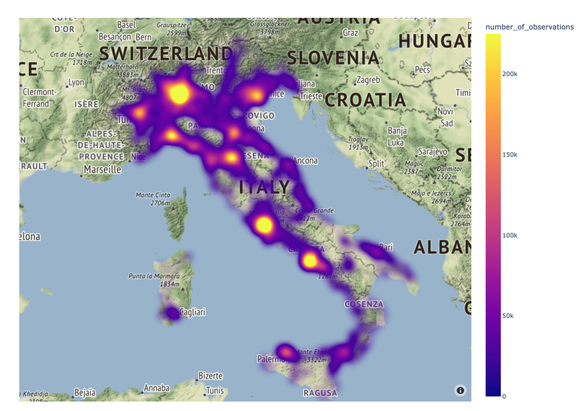
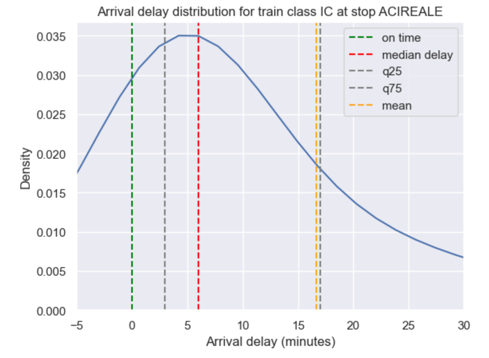

# Project of Data Visualization (COM-480)

| Student's name | SCIPER |
| -------------- | ------ |
| Giacomo Orsi | 337360 |
| Francesco Salvi | 338681 |
| Roberto Ceraolo | 343261 |

[Milestone 1](#milestone-1) • [Milestone 2](#milestone-2) • [Milestone 3](#milestone-3)

## Milestone 1 (23rd April, 5pm)

**10% of the final grade**

This is a preliminary milestone to let you set up goals for your final project and assess the feasibility of your ideas.
Please, fill the following sections about your project.

*(max. 2000 characters per section)*

### Dataset

> Find a dataset (or multiple) that you will explore. Assess the quality of the data it contains and how much preprocessing / data-cleaning it will require before tackling visualization. We recommend using a standard dataset as this course is not about scraping nor data processing.
>
> Hint: some good pointers for finding quality publicly available datasets ([Google dataset search](https://datasetsearch.research.google.com/), [Kaggle](https://www.kaggle.com/datasets), [OpenSwissData](https://opendata.swiss/en/), [SNAP](https://snap.stanford.edu/data/) and [FiveThirtyEight](https://data.fivethirtyeight.com/)), you could use also the DataSets proposed by the ENAC (see the Announcements section on Zulip).

We decided to use for this project the [TrainStats](https://mega.nz/folder/vIAyDaTJ#PcLTFDbKaJaa0FZIEh5E-w) dataset, a collection of data about Italian train delays. The dataset contains historical data about all types of trains managed by *Trenitalia*, the primary train operator in Italy. The company holds about 80% of the Italian high-speed rail market shares in terms of annual passengers, with the remaining 20% being taken by [*Italo*](https://www.itf-oecd.org/sites/default/files/docs/high-speed-rail-competition-italy.pdf), data until 2016). When it comes to traditional railway, *Trenitalia* carries instead the totality of passengers, with no direct competitor neither nationally nor regionally. Therefore, we will consider the data to be sufficiently representative of the entire train system in Italy. Since Trenitalia doesn’t publicly release historical data about the actual circulation of its trains, TrainStats was scraped independently from the website [ViaggiaTreno](http://www.viaggiatreno.it/infomobilita/index.jsp), which provides real-time daily information for each train at the national level ([reddit post](https://www.reddit.com/r/italy/comments/d702r4/ho_creato_un_sito_per_monitorare_i_ritardi_di/). The dataset contains data from 2020 until today, and is constantly kept up to date. Since both the format of the data and the train schedule of Trenitalia changed often over time, we decided to only focus on the first 3 months (⚠ TODO: decide a number of months) of 2023, from January to March. 

The data is available in a .json format at the daily level. Each file contains some aggregate statistics about the mobility of the day, such as the total number of trains by category, the number of delayed trains and the total delay. Then, the details of all the trains are presented individually: for each train, we get to know its serial number, its category, and a list of all its stops, including for each of those their arrival and departure time and their arrival and departure delays.
⚠ TODO: commentare su “how much preprocessing / data-cleaning it will require” dopo aver visto il notebook

### Problematic

> Frame the general topic of your visualization and the main axis that you want to develop.
> - What am I trying to show with my visualization?
> - Think of an overview for the project, your motivation, and the target audience.

The motivation of the project comes from the crucial lack of open data regarding public transportation in Italy: differently from what happens in other European countries, Switzerland especially, there is no public database curating these data nationally and releasing them in an aggregate form. Transportation is unfortunately not an exception, since Italy ranks 32nd in the global rankings of the [Open Data Index](http://index.okfn.org/place/), with major shortcomings in other key categories. TrainStats is a great place to start exploring rail transport, but the data is currently presented in a form very close to raw: the website only shows basic aggregate statistics and visualizations, and only at the level of a single day or a single train. In addition, the UI is very minimal, and it is not easy to navigate the website nor to quickly gain insights or general trends. In other words, these data are currently readable by engineers, who know how to approach and process them, but not by everyone else. The goal of this project is to fill this gap, by making them available to the general population in a simple and intuitive manner. On one side, this would be a service to the community, improving the information currently available and helping people in planning a more informed trip schedule. On the other, it would improve public accountability, pushing Trenitalia to improve its rail system to decrease delays and malfunctions.

We plan on achieving this goal by working on two key visual axes:
(at least) One big interactive visualization, where people can immediately get an overall picture of the situation on a national map. Ideally, users would be able to search for a specific train or a specific station, explore its connections on the map and visualize some aggregate historical statistics.
A data story, where we can coherently unfold key insights about the national train landscape. This would include several smaller visualizations, focused on specific points serving our storytelling. Some questions that we would be interested in exploring are for example: Is there a substantial divide between North and South, in terms of connectivity and efficiency? What are the worse trains/stations/itineraries, and is there a temporal pattern during the day/week/month?

### Exploratory Data Analysis 

> Pre-processing of the data set you chose
> - Show some basic statistics and get insights about the data

<figure>
  
</figure>

After selecting the project's scope and goal, we began working with the dataset. The key steps involved handling the dataset's large size using pySpark, cleaning the data to ensure consistency across tables, lines, and time, and conducting exploratory data analysis to gain a better understanding of the data, produce visualizations of summary statistics and maps. This work is crucial for the next stages of the project, and all data wrangling and exploration steps have been documented in this folder. At the outset, the dataset was in JSON format, containing information on each train and stop, with feature names in Italian. Due to the timeframe considered, the dataset was 15GB in size, requiring the use of pySpark. Following some data wrangling, we obtained a convenient data frame format, manageable in size, in English, and with a row for each "route," defined as the path between two stops. 
<figure>
  
</figure

With clean data, we were able to visualize various aspects, such as the distribution of delay on arrival for a given station or class of trains, explore the best and worst stations in terms of punctuality. We also identified a trend in southern Italy stations having the highest delays, so we will be investigating this further. We produced heatmaps highlighting the differences in service availability of Italian trains. 

Finally, we plotted train paths on the map, utilizing an algorithm from [Bast and Bosi](https://developer.geops.io/apis/routing) to display the actual path of the railway, going beyond simple station-to-station straight lines. These steps serve as the foundation for the interactive visualizations we will build.

### Related work 

> - What others have already done with the data?
> - Why is your approach original?
> - What source of inspiration do you take? Visualizations that you found on other websites or magazines (might be unrelated to your data).
> - In case you are using a dataset that you have already explored in another context (ML or ADA course, semester project...), you are required to share the report of that work to outline the differences with the submission for this class.

One of the thoughts that prompted us to pursue this project, is the absence of clear and powerful works that allow users to visualize and explore data about the Italian trains. This is clearly due to the absence of an official data source from Trenitalia, and the need to scrape data. Nevertheless, there is one main previous work that was done in the same direction as ours, the author of which is also who is kindly providing us with the scraped data. [Trainstats](https://trainstats.altervista.org) is a website with up-to-date information about Italian trains, including summary statistics regarding delays. Though we acknowledge the authors did a great job gathering the data, we think visualizations could be more intuitive and clearer, to reach a broader audience, and not only Data Scientists, Data Analysts and Engineers. We believe our approach is original because of 3 main reasons: firstly, the audience – our project is a unicum in providing the general audience with an unveiling of the performances of Italian railways; secondly, Italian train data in general has never been deeply explored and analyzed from Data Scientists, at least not in public; thirdly, we will gather insights that will expose strengths and weaknesses of Trenitalia, and could potentially be used by the company itself to improve the service. Our main inspiration is the [SBB case]( https://data.sbb.ch/) in Switzerland, both in terms of “data openness”, and in terms of visualizations. They provide users with interactive maps, that allow a full exploration of the public transport means, also showing real-time positions of the vehicles. They also publish reports about the delays, with meaningful graphics highlighting the best and worst-performing stations and lines in terms of punctuality. We aim at reproducing, at a smaller scale, similar functionalities for Italian public transport.

### References
[*SBB case, our main inspiration*]( https://data.sbb.ch/)

[*Trainstats, our source of data*](https://trainstats.altervista.org)

[*Italo, competitor of Trenitalia*](https://www.itf-oecd.org/sites/default/files/docs/high-speed-rail-competition-italy.pdf)

[*ViaggiaTreno, official Trenitalia platform](http://www.viaggiatreno.it/infomobilita/index.jsp)

[*Reddit Post, Users introducing scraping for italian trains *](https://www.reddit.com/r/italy/comments/d702r4/ho_creato_un_sito_per_monitorare_i_ritardi_di/)

[*Open Data Index*](http://index.okfn.org/place/)

[*Algorithm for plotting routes*](https://developer.geops.io/apis/routing)

## Milestone 2 (7th May, 5pm)

**10% of the final grade**

## Milestone 3 (4th June, 5pm)

**80% of the final grade**

## Late policy

- < 24h: 80% of the grade for the milestone
- < 48h: 70% of the grade for the milestone

